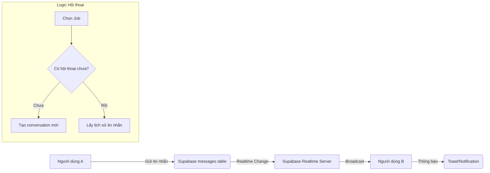
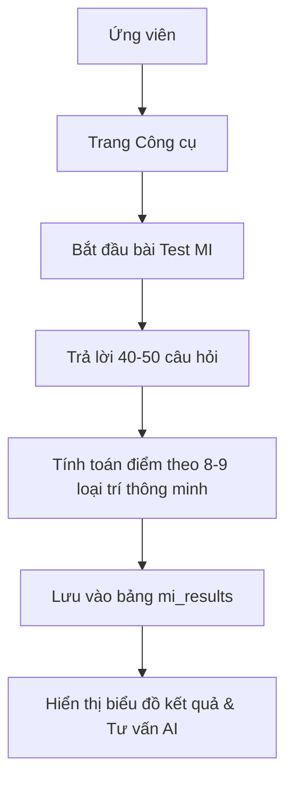

# NP FutureGate - So sánh App vs Web & Kế hoạch hoàn thiện

## 📊 1. Phân tích hiện trạng

| Tính năng | App (Flutter) | Web (React/Vite) | Trạng thái trên Web |
| :--- | :--- | :--- | :--- |
| **Hệ thống Chat Realtime** | ✅ Đầy đủ (Supabase Realtime) | ❌ **Thiếu hoàn toàn** | Cần bổ sung |
| **Trắc nghiệm MI (Đa trí tuệ)** | ✅ Cho ứng viên | ❌ **Chỉ có Admin quản lý** | Cần bổ sung cho Candidate |
| **Lịch phỏng vấn (Ứng viên)** | ✅ Xem & Quản lý lịch | ❌ **Chưa có giao diện cho UV** | Cần bổ sung |
| **Nhập liệu bằng giọng nói** | ✅ Speech-to-Text tích hợp | ❌ **Chưa hỗ trợ** | Cần bổ sung Web Speech API |
| **Hệ thống thông báo** | ✅ Push (FCM) & In-app | ✅ Cơ bản | Cần tối ưu UI/UX |
| **Mẫu CV & Editor** | ✅ Đa dạng, Preview PDF | ✅ Đã có Editor cơ bản | Cần nâng cấp UI Premium |
| **Dashboard chuyên sâu** | ✅ Mobile widgets | ✅ Có Admin dashboard | Cần Dashboard đẹp cho UV/NTD |
| **Giao diện Responsive** | ✅ Mobile-first | ✅ Responsive cơ bản | Cần chuẩn hoá "Premium Web" |

---

## 🛠️ 2. Sơ đồ luồng (Flow Diagrams) của các tính năng thiếu

### A. Hệ thống Chat Realtime

### B. Bài test Đa trí tuệ (MI Test)

---

## 🚀 3. Kế hoạch triển khai (Implementation Plan)

### Bước 1: Hạ tầng & Core Components
- Bổ sung `ChatProvider` & `ChatService` sử dụng Supabase Realtime.
- Tạo component `SpeechInput` hỗ trợ nhập liệu giọng nói.
- Nâng cấp `Navbar` với Notification Hub & Chat Quick Access.

### Bước 2: Hoàn thiện tính năng Ứng viên (Candidate)
- Triển khai **MI Test Page** (Giao diện chuẩn web, kéo trượt mượt mà).
- Triển khai **Candidate Interview Schedule Page**.
- Xây dựng **Chat Page** (Full screen chat & Mini chat overlay).

### Bước 3: Hoàn thiện tính năng Nhà tuyển dụng (Employer)
- Triển khai **Chat with Candidates**.
- Bổ sung **Voice search** trong Search Candidates.
- Tối ưu **Dashboard Statistics** với biểu đồ Premium (Chart.js/Recharts).

### Bước 4: Tối ưu UI/UX "Premium Web"
- Áp dụng Glassmorphism cho Sidebar & Card.
- Thêm các Micro-animations (Framer Motion).
- Đảm bảo Responsive chuẩn trên mọi kích thước màn hình (MB, Tablet, Desktop 4K).

---

## 💎 4. Tiêu chuẩn thiết kế (Design Standards)
- **Màu sắc**: Primary (#1E88E5), Secondary (#FFC107), Safe-area backgrounds (#F8FAFC).
- **Typography**: Inter / Outfit (Modern, Readability).
- **Layout**: Sidebar cố định bên trái, Header cố định, Content cuộn độc lập.
- **Interaction**: Hover effects, Skeleton loading, Smooth transitions.
